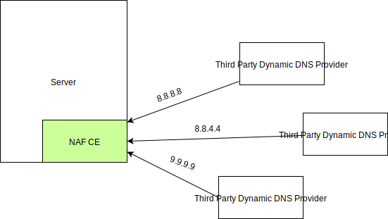
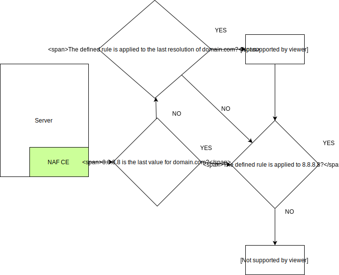

## Not Another Firewall

NAF-CE is a solution for adding or deleting iptables rules in order to allow or deny hosts based on DNS resolution.
NAF-CE is not a firewall and doesn't replace one. Its a custom solution for small teams of developers that wants to collaborate on a dedicated server without exposing it to everyone and without having to deal with complex configurations.

NAF-CE check the domain resolution for each domain and add or delete the defined "allow_rule" rule replacing the {ip} keyword with the resolution of the domain name

It should be use with a dynamic DNS provider such as DuckDNS. If you use DuckDNS please consider donating to their project.

## How it works?

A list of domain names need be registered. Once they are registered
NAF-CE will ask and apply the `allow_rule` set by default to `-A INPUT -s {ip} ACCEPT` being `{ip}` the resolution
of each of the domains registered.

In the next image, NAF-CE will have 3 domains registered:

- domain1.com
- domain2.com
- domain3.com

Each five minutes NAF-CE will try to query the IP address of each domain.

DNS Servers will provide NAF-CE the requested information.

Finally NAF-CE will follow the next workflow diagram for each response maintaining or updating `iptables` rules.

## Requirements
- python3
- iptables

### Tested on
- Ubuntu 18.04
- Proxmox PVE 5

## Installation
* git clone https://github.com/elchicodepython/naf-ce
* cd naf-ce
* sudo ./setup.sh
* sudo crontab -u root -e 
* Add the following line to crontab: 5 * * * * /usr/bin/naf-ce update

### Interactive configuration

TODO: To be completed

## Manual Configuration

NAF-CE is based in a configuration file placed on /etc/naf/rules.json

Example of configuration file:

{
	"allow_rule": "-A INPUT -s {ip} ACCEPT",
	"domains": [
		{
		"name": "domain.com",
		"ip": "8.8.8.8"
		}
	]
}

### Add a domain

* Open /etc/naf/rules.json
* Add inside domains:[] a domain with the following structure: {"name": "mydomain.com", ip:""}
* It doesn't matter if we leave the IP empty at the moment
* Save the file

### Manual updating rules
* sudo naf-ce update

